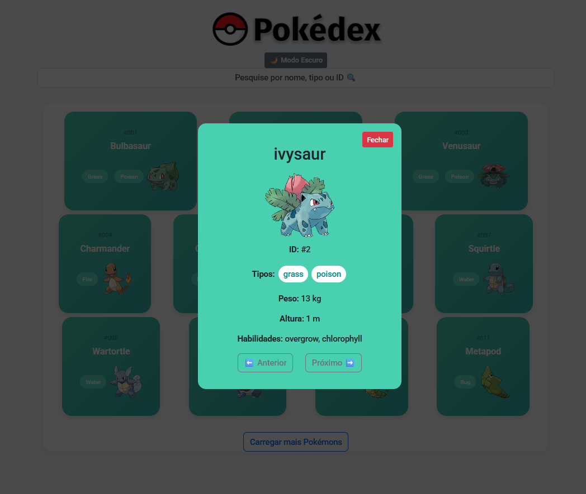

# Pokédex

Este é um projeto de uma Pokédex interativa que consome a API pública [PokéAPI](https://pokeapi.co/). O objetivo é listar os Pokémons, exibir detalhes de cada um e permitir a busca por nome, tipo ou ID.

## Funcionalidades

- Listagem de Pokémons com paginação.
- Busca por nome, tipo ou ID.
- Modal com detalhes do Pokémon selecionado.
- Alternância entre modo claro e escuro.

## Tecnologias Utilizadas

- HTML5
- CSS3
- JavaScript (ES6+)
- [PokéAPI](https://pokeapi.co/)

## Capturas de Tela

### Tela Inicial (Modo Claro)


### Tela Inicial (Modo Escuro)


### Modal de Detalhes (Modo Claro)


### Modal de Detalhes (Modo Escuro)


## Como Executar o Projeto

1. Clone este repositório:
   ```bash
   git clone https://github.com/seu-usuario/pokedex.git

2. Navegue até o diretorio do projeto:
    ```bash
    cd pokedex

3. Abra o arquivo index.html em seu navegador.

### Estrutura do Projeto
pokedex/
├── assets/
│   ├── css/
│   ├── js/
│   ├── screenshots/
│   │   ├── tela-inicial-claro.png
│   │   ├── tela-inicial-escuro.png
│   │   ├── modal-claro.png
│   │   ├── modal-escuro.png
├── [index.html](http://_vscodecontentref_/1)
└── [README.md](http://_vscodecontentref_/2)

## Créditos

API utilizada: PokéAPI  
Ícones e fontes: Google Fonts, Bootstrap Icons  

## Licença

Este projeto é de uso livre para fins educacionais e pessoais.

